# Learning goals for DI

## Prerequisites

- Python 3.10 or higher
- pnpm

## Setting up the environment

### Finding the repo

You have already made your way to [this directory](https://github.com/Thomas-More-Digital-Innovation/2526-learning-goals-template)!

### Forking

Fork the repository to your own account.
You can do this by clicking the "Fork" button in the top right corner of the page.

**Click on the "Fork" button in the top right corner**
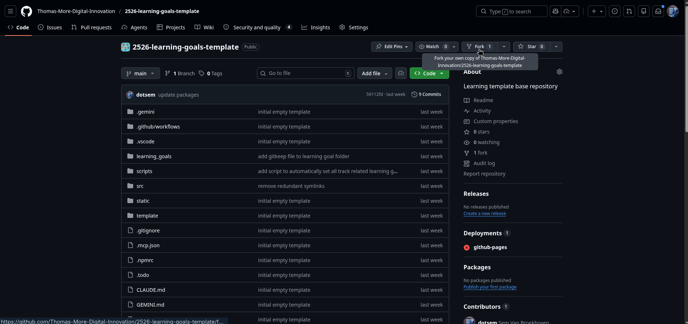

By forking the repository, you can add your own learning goals to the repository and still contribute to the original repository.

Name it something with learning goals.
A good description is never a bad idea.

**Click on "Create fork"**
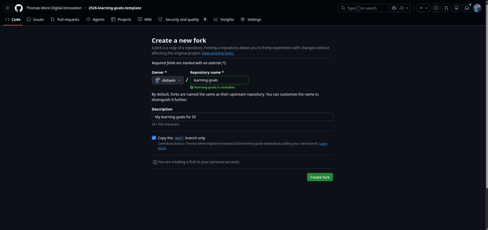


If you didn't read the obvious instructions on github: this fork is created in your personal github account.

If everything went well, you'll see the repo in your personal account.

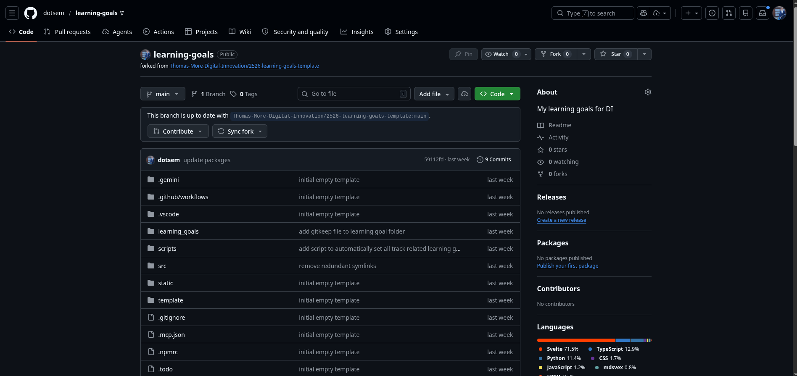


### Cloning

Now copy the url of your forked repository.

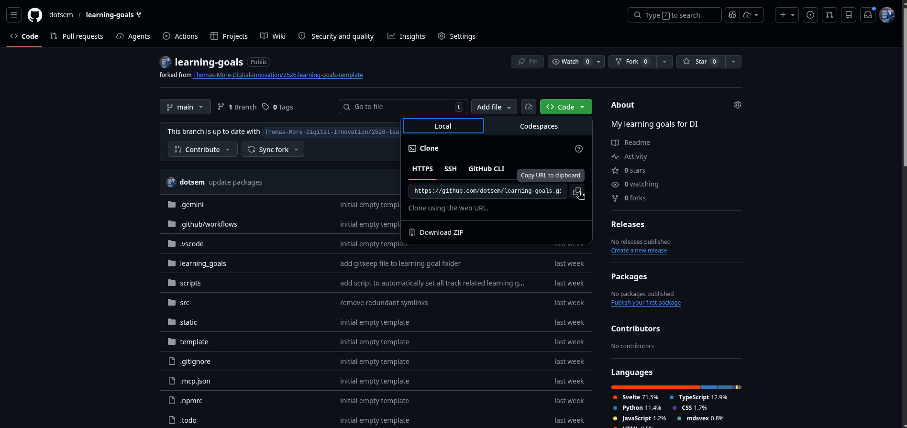

And clone it to your local machine.

```bash
git clone <url>
```

### Setup

Now open your favorite IDE and open the folder you just cloned.

#### If you are migrating
Remove the initial `learninggoals.json` file.

Copy your `learninggoals.js` file from your old repository to this repository.
Rename the file to `learninggoals.json` and remove the 
```js
const learningGoals =
```
and the semicolon at the end of the file.

This would result in valid JSON syntax.

#### Creating the learning goal structure

Now that you have the `learninggoals.json` file, we can use it to generate our structure.

In your project folder, run the following command:

```bash
python scripts/migrate_goals.py
```

This will generate the structure  in the `learning_goals` folder and the `VERIFICATION.jsonc` file.

If everything went well, you'll see the following output:

```
*all learning goals that have been migrated*
Generated VERIFICATION.jsonc
Migration task finished.
```

#### Learning goals folder

This folder contains all learning goals, organized by major.
Each major has its own folder, with the number of the major as the folder name.
Each learning goal has its own folder, with the number of the learning goal as the folder name.
Each learning goal folder contains a `goal.json` file, and evidence.svx file and an assets folder.

##### goal.json

This file contains the learning goal data.

```json
{
    "$schema": "../../../src/lib/learningGoalsSchema.jsonc",
    "number": "1.1",
    "title": "You identify functional requirements and translate these into standardised conceptual models (use case diagram, data model) taking into account the business context.",
    "track": [
        "APP",
        "AI"
    ],
    "status": "",
    "project": ["OPO 2APP-AI SM&D"]
}
```

This file uses a schema to validate the learning goal data. The schema is located in the `src/lib/learningGoalsSchema.jsonc` file.
In this schema you can add projects

common projects:
- OPO 2APP-AI SM&D
- OPO SKILL2
- OPO SKILL3

You can also add your own projects. For example:
- 2627-NASA-001-hacking-nasa-infrastructure

This adds these projects to your IDE's Intellisense for auto-completion.

**Do not edit the number, title and track fields manually.**
You can however (and probably should) edit the status and project fields.


##### evidence.svx

This file contains the evidence for the learning goal.
The file is written in svx, a markdown preprocessor for svelte. It allows you to add svelte components to your markdown file.
**Read more at [Writing your evidence](#writing-your-evidence)**

##### assets

This folder contains the assets for the learning goal.
Here you can add screenshots, videos, links, ... to support your learning goal.

#### VERIFICATION.jsonc

This file is for your coaches. It is a simple key value list where the key is the number of the learning goal and the value is the name of the coach who verified the learning goal.

**Do not edit this file manually.**

##### What is jsonc?

JSONC is a variant of JSON that allows for comments. It is a superset of JSON, meaning that all valid JSON is also valid JSONC. However, JSONC also allows for comments, which are not allowed in standard JSON.

> yay! you learned something new today!

### Change this variable

in `svelte.config.js` update `/Doelstellingen` to `/<your-repo-name>`

## Choosing your track

If you have chosen which track you want to follow, you can automatically set all related learning goals to "Todo" by running the following command:

```bash
python scripts/set_track.py <track>
```
You can choose between APP, AI, and CCS.
> I know making choices is hard :)

## Deploying

You now have an lot of staged files in your git repository.
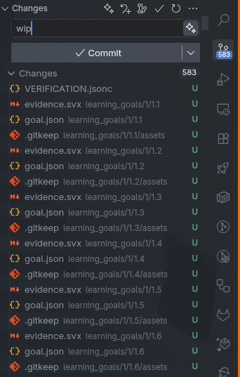

Craft your best commit message and commit your changes.

```bash
git add .
git commit -m "Add learning goals"
git push
```

### Enabling github pages

Go back to your github repository and open the settings.

**Click on "Pages" in the left sidebar.**
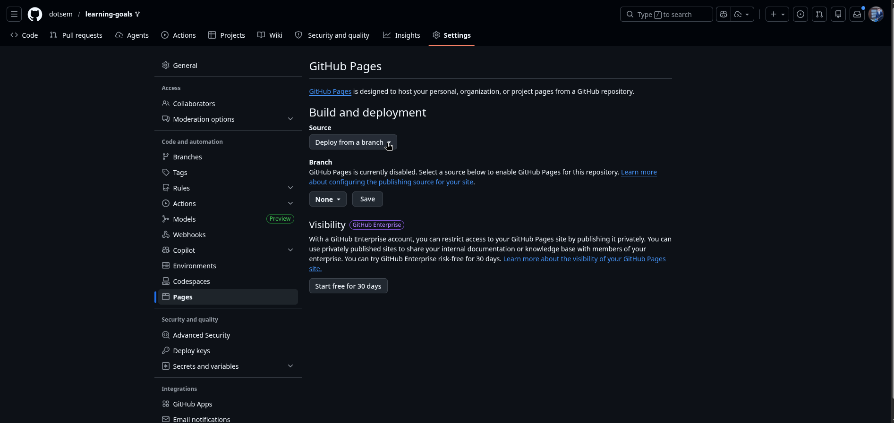


**Select "Github Actions"**
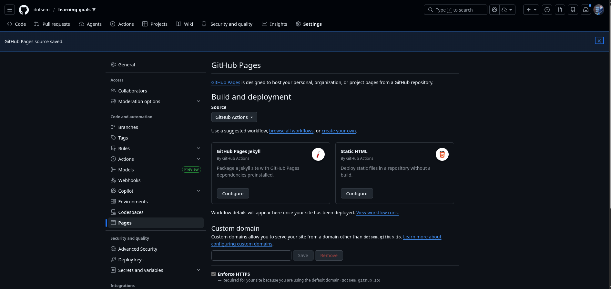


### Enabling github actions

Go back to your github repository and enable the github actions.

**Click on "I understand my workflows, go ahead and enable them"**
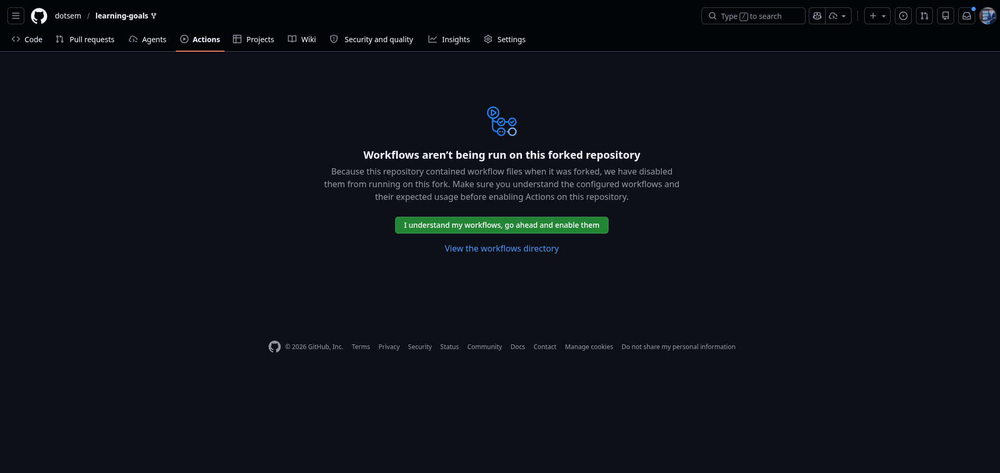


You should see one available workflow.

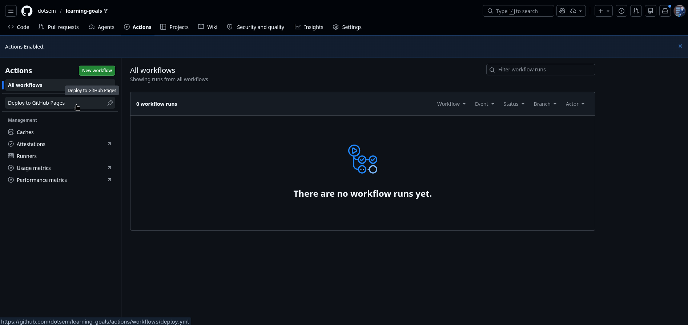

When you open that page, you'll see a "Run workflow" button.

**Click on it to run the workflow (just use the main branch as set by default).**
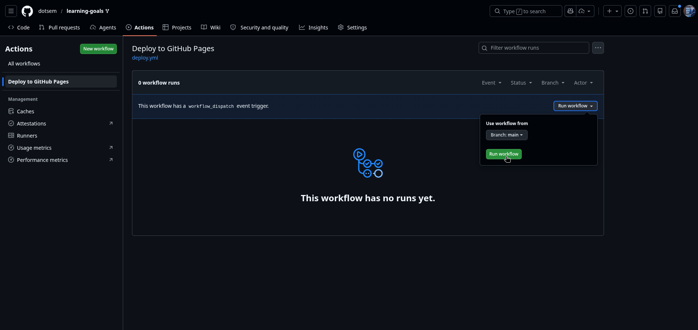


If you haven't been cursed by the devil, you should see the following output:
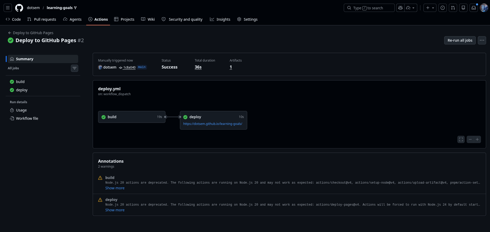

**Your website is now available at https://<username>.github.io/<repository-name>**

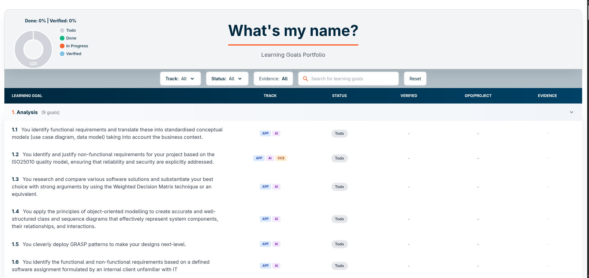

### Good question, what is my name?

go to `src/lib/user.svelte.ts` and edit the `user` variable.

## Local development

Install pnpm if you haven't already ->
[RTFM](https://pnpm.io/installation)

### Setup

First you need to install the dependencies.

```bash
pnpm install
```

### Running

To run the website locally, you can use the following command:

```bash
pnpm dev
```

This also adds hot reload, so you can see your changes immediately.

Go to `http://localhost:5173` to see your website.

> There is no place like 127.0.0.1 :D

## Writing your evidence

You'll write your evidence in the `evidence.svx` files. 
Each evidence file is already populated with a template.
You can use this, or ditch it, your choice :)

### Components

There are 3 provided components:
- `src/lib/components/Evidence.svelte`
- `src/lib/components/Project.svelte`
- `src/lib/components/Skill.svelte`

These components are used to display the evidence, projects, and skills.

### Evidence

```svx
---
visible: false
---
<script>
    import { Image, Video, Pdf } from "$lib/components/evidence"; 
</script>

# Learning something

I did this learning goal very well, trust me

<Image src="image.png" alt="image" />
<Video src="video.mp4" alt="video" />
<Pdf src="pdf.pdf" alt="pdf" />
```
notice that we just use the names of the assets we used, you don't have to append a path. The components will find the assets for you.

Once you are happy with your evidence, you can set the `visible` variable to `true`. This means that the evidence will be visible on your website.

**push your changes to github and check your website**

You will see your completed learning goal on your website.
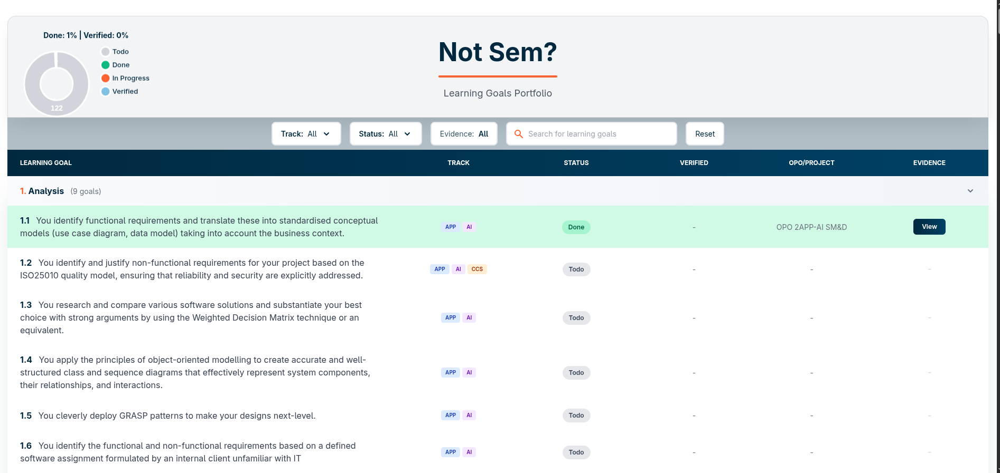

You can view your evidence.
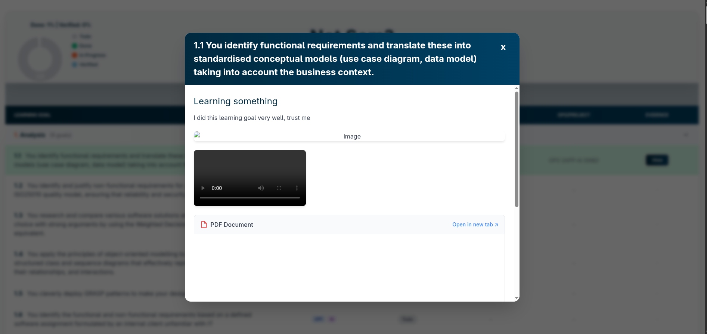
Notice that our assets don't load, this is simply because we didn't add them to the `assets` folder.

When a coach verifies your learning goal, you can see it on the website.
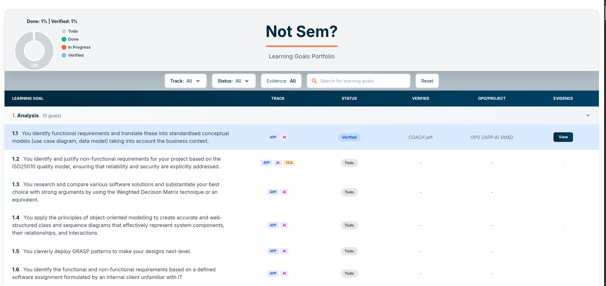

## Filters on the website

We have some filters on the website. 

### Track filter

Filter by track (APP, AI, CCS, DI, EVERYTHING)

### Status filter

Filter by status (Todo, In Progress, Done, Verified)

The empty field is for learning goals without status (probs not relevant for you).

### Evidence filter

This filters the learning goals based on whether you have added evidence for them or not. Handy to quickly see what you still need to document.

### Searching

You can also search for learning goals by title or description.

### Reset

Reset

## Contributing

Either cherry pick your solution so you don't include anything from your own learning goals or create a new fork for your changes.
(or think ahead and create a new branch before you start working on your learning goals)

Then make a pull request and let someone review your changes.

## Troubleshooting

You have AI now, use it.
